# PlatformerGL
##### LEJA team
Jarod SENGKEO
Leon THOMPSON

## Table of Contents

- [PlatformerGL](#platformergl)
        * [LEJA team](#leja-team)
  * [Table of Contents](#table-of-contents)
    + [Description](#description)
  * [Features Implemented](#features-implemented)
  * [Controls](#controls)
    + [Application Controls](#application-controls)
    + [Camera Controls](#camera-controls)
      - [Game Mode](#game-mode)
      - [Editor Mode](#editor-mode)
    + [Player Controls](#player-controls)
      - [Game Mode](#game-mode-1)
      - [Editor Mode](#editor-mode-1)
  * [Menu](#menu)
  * [SCN File](#scn-file)
  * [Editor](#editor)
    + [Application Window](#application-window)
      - [Scenes](#scenes)
      - [Info](#info)
      - [Settings](#settings)
      - [Debug](#debug)
    + [Scene Window](#scene-window)
  * [GameObjects](#gameobjects)
    + [Player](#player)
    + [Enemy](#enemy)
    + [Platform](#platform)
  * [Problems/Bugs](#problems-bugs)
  * [Notes](#notes)
    + [End](#end)
	
### Description
PlatformerGL is a basic platformer game that uses a render engine based on OpenGL and takes advantage of a collision library testing box-sphere and sphere-sphere collisions.

### Compilation
In order to compile correctly, the folder "Assets", must be in the project directory. The asset folder is available in the LEJA.zip on Sirius.

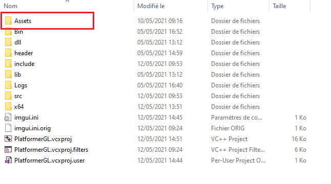

## Features Implemented
- Player movement is managed by a physics engine with gravity, velocity, etc.
- Player uses a state manager
- Platforms can be loaded with different texture types
- Supports a library of collisions, principally SPHERE-BOX & SPHERE-SPHERE
	- The player and enemies are represented by a sphere. Platforms are represented by a cube.
	- Colliders can be set to visible in the editor.
- Supports a game mode where the camera is fixed on the player an editor mode where the camera can be moved freely.
- Saving and loading of the game scene using SCN files.
- A menu with options to launch, load and exit the game.
- Supports 3D models defined by an OBJ file with 3-vertex(*triangle*) faces
- MTL file parser
- Capable of loading any texture format supported by the STB_IMAGE library, to include TGA, PNG, JPEG, BMP, GIF, etc.
- Capable of rendering multiple scenes, each with multiple models.
- Background configurable on a per scene basis
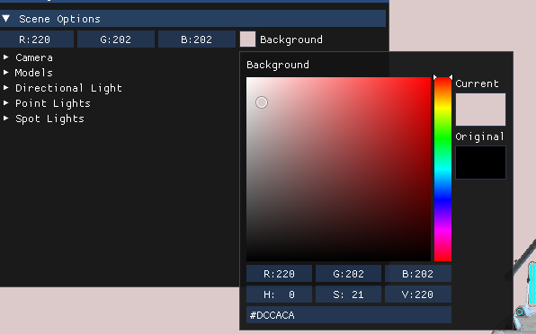

## Controls

### Application Controls
- **ESC** : Escape to menu
- **F5**:  Save the scene

### Camera Controls
- '9' : Enter Camera mode
	- Used to control the player and move the camera (mouse disappears)
- '0' : Exit Camera mode
	- Used to access the editor (mouse reappears)

#### Game Mode
- None
#### Editor Mode
- **w, a, s, d**       : forward, left, back, right
- **spacebar**      : up
- **CTRL**           : down
- **mouse/touchpad**    : rotate
- Camera Position, as well as FOV, near & far can be adjusted manually via camera settings in the ImGui menu

### Player Controls
#### Game Mode
- Basic Movement(left, right, forward, back)
	- **w, a, s, d**   
- Jump
	- **spacebar** 
#### Editor Mode
- None

## Menu
- Options for New Game, Load  & Exit

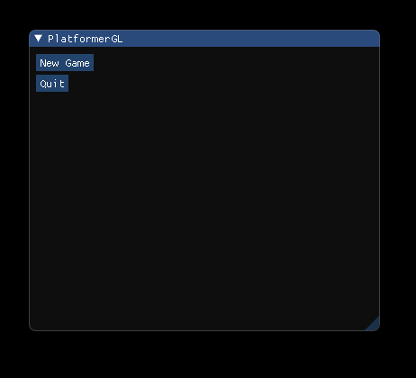
- Load only appears after a save

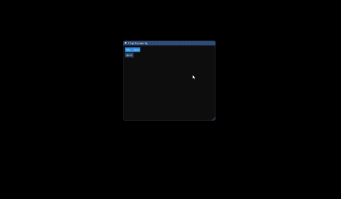

## SCN File
An scn file is used to load the initial settings of each scene to include the game objects, lights and the camera.
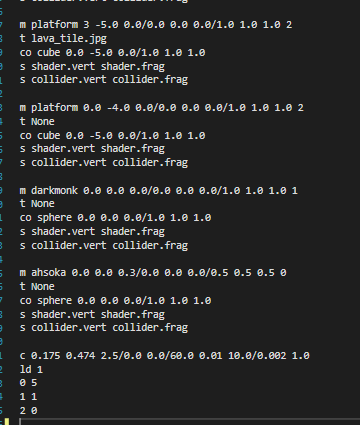

There is a file "example.scn" included within scenes that explains how it works.
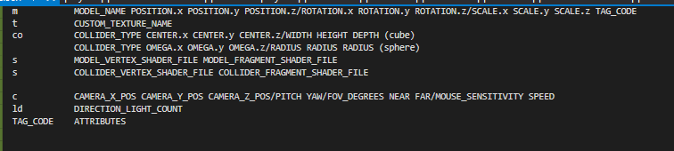

## Editor
### Application Window
#### Scenes
- Slider to change scene
#### Info
- Mouse position
#### Settings
- Mode : Activate Game mode
#### Debug
	- Enable Logs
	- Enable Assertions

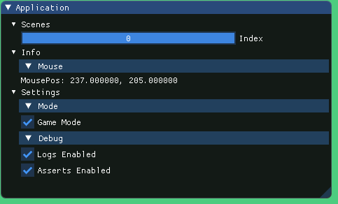

### Scene Window
- Scene Options
	- Background Color
	
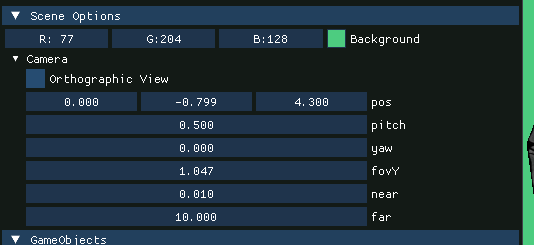

	- Camera
		- Orthographic View
		- Position
		- Pitch
		- Yaw
		- FOV
		- Near
		- Far

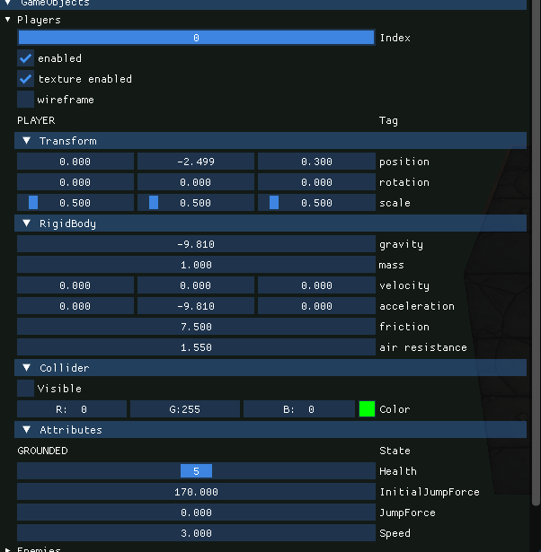
- GameObjects
	- Players, Enemies & Platforms all have the following setup:
		- Slider to change selected object
		- Checkbox to activate/deactivate render of object
		- Checkbox to activate/deactivate texture
		- Checkbox to activate/deactivate wireframe mode
		- Tag
		- Transform
			- Position
			- Rotation
			- Scale
		- RigidBody
			- Gravity
			- Mass
			- Velocity
			- Acceleration
			- Friction
			- Air Resistance
		- Collider
			- Checkbox to show the collider
			- Collider Color
		- Attributes (Variables specific to the player)
			- State (GROUNDED or JUMPING)
			- Health
			- Initial Jump Force
			- Jump Force (over time)
			- Speed
	- Lights

## GameObjects

### Player

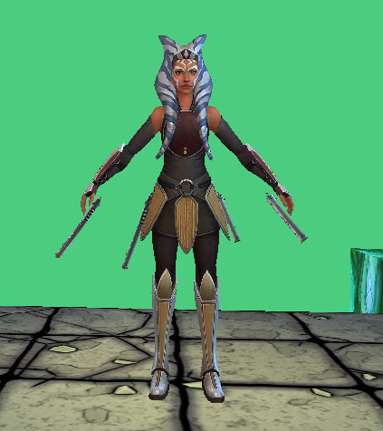
### Enemy

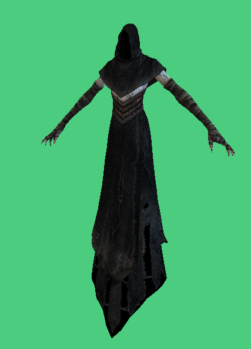
### Platform

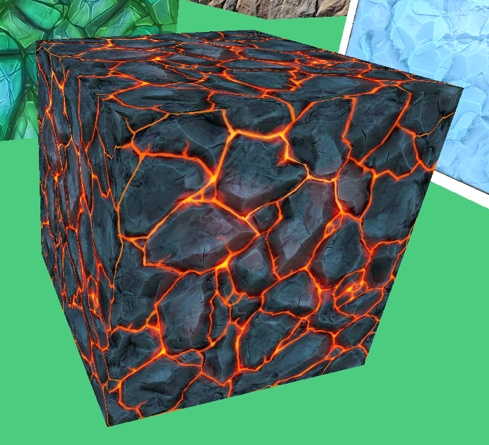

## Problems/Bugs
- Can not change platform color after deactivating the texture.

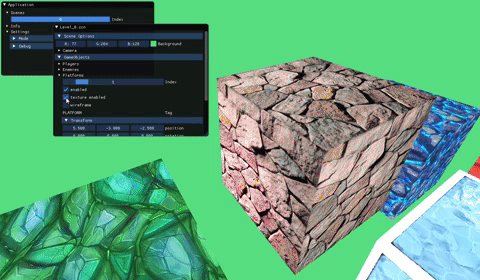
- Rendered sphere collision collider only matches what is visually seen on the screen if the scale of the player or enemy is 0.5 in the y. The platforms do not have this issue.

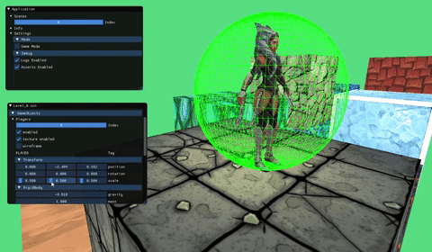

- Occasionally, the player appears to hit an invisible wall.

 

## Notes
- If all the objects in the scene are black, make sure that the directional light is activated.

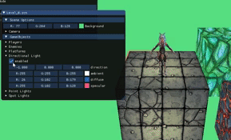

### End